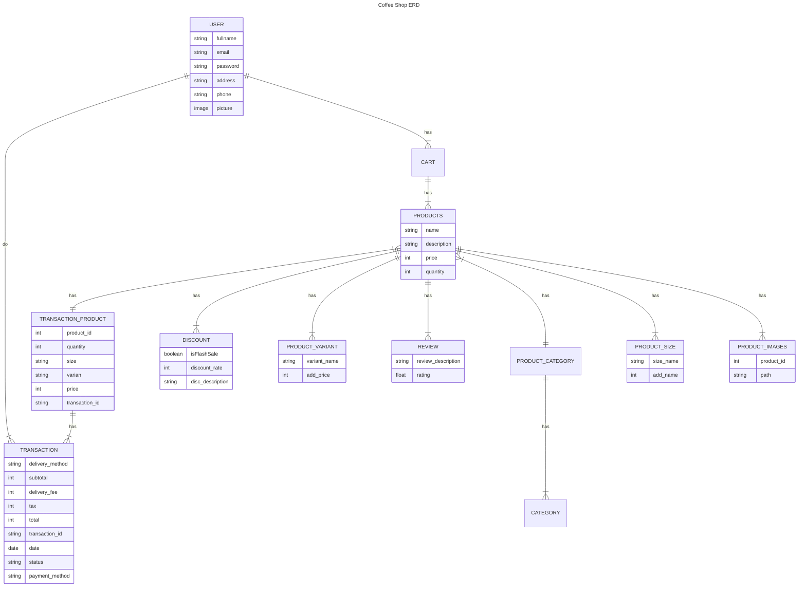

```mermaid
---
title : Coffee Shop ERD
---
erDiagram
    direction TB

    PRODUCTS {
        string name
        string description
        int price
        int quantity
    }

    USER {
        string fullname
        string email
        string password
        string address
        string phone
        image picture
    }

    TRANSACTION {
        string delivery_method
        int subtotal
        int delivery_fee
        int tax
        int total
        string transaction_id
        date date
        string status
        string payment_method 
    }

    TRANSACTION_PRODUCT {
        int product_id
        int quantity
        string size
        string varian
        int price
        string transaction_id
    }

    CART {
    }

    DISCOUNT {
        boolean isFlashSale
        int discount_rate
        string disc_description
    }

    PRODUCT_VARIANT {
        string variant_name
        int add_price
    }

    PRODUCT_IMAGES {
        int product_id
        string path
    }

    CATEGORY {}

    PRODUCT_CATEGORY {}

    PRODUCT_SIZE {
        string size_name
        int add_name
    }

    REVIEW {
        string review_description
        float rating
    }

PRODUCTS }|--|| TRANSACTION_PRODUCT :has
TRANSACTION_PRODUCT ||--|{ TRANSACTION :has
USER ||--|{ TRANSACTION : do
USER ||--|{ CART : has
CART ||--|{ PRODUCTS :has
PRODUCTS ||--|{ DISCOUNT :has
PRODUCTS ||--|{ PRODUCT_VARIANT :has
PRODUCTS ||--|{ REVIEW :has
PRODUCTS }|--|| PRODUCT_CATEGORY: has
PRODUCT_CATEGORY ||--|{ CATEGORY :has
PRODUCTS ||--|{ PRODUCT_SIZE :has
PRODUCTS ||--|{ PRODUCT_IMAGES :has
```